<!-- ══ WAVE HEADER ══ -->

  

<!-- ══ BANNER ══ -->

  

<!-- ══ TYPING ══ -->

  

<!-- ══ BADGES ══ -->

  
  &nbsp;
  
  &nbsp;
  

 

---

### 💻 &nbsp;`$ whoami --verbose`

  

---

### 📊 &nbsp;`$ neofetch --github`

  

  
  &nbsp;
  

  

---

### ⚡ &nbsp;`$ cat tech-stack.md`

  

📋 &nbsp;<b>Full Skill Breakdown</b> &nbsp;— click to expand

 

| Category | Skills |
|:---|:---|
| **Languages** |      |
| **AI / ML** |      |
| **Cloud** | -0078D4?style=flat-square&logo=microsoftazure&logoColor=white) |
| **Web / Tools** |     |

---

### 🏆 &nbsp;`$ cat achievements.log`

| &nbsp; | Event | Host | Result |
|:---:|:---|:---|:---:|
| 🏆 | **Zero to One Hackathon** | Chandigarh University | **1st Place / 600+ Teams** |
| 🥈 | **HackLLM Hackathon** | IIIT Delhi | **Runner-Up · LLM Track** |
| 🌟 | **GirlScript Summer of Code** | Open Source (GSSoC) | **Contributor** |

---

### 🎓 &nbsp;`$ ls certifications/ -la`

<table>
<tr>
<td align="center" width="160">
   
  <b>Azure AI Engineer</b> <code>AI-102</code>
</td>
<td align="center" width="160">
   
  <b>Data Scientist</b> <code>DP-100</code>
</td>
<td align="center" width="160">
   
  <b>Fabric Analytics</b> <code>DP-600</code>
</td>
<td align="center" width="160">
   
  <b>Oracle OCI</b> <code>Cloud Certified</code>
</td>
<td align="center" width="160">
   
  <b>Postman Expert</b> <code>Student Expert</code>
</td>
</tr>
</table>

---

### 🚀 &nbsp;`$ ls projects/ --pinned`

  
  &nbsp;
  

  
  &nbsp;
  

---

### 🐍 &nbsp;`$ watch contribution-snake`

  <picture>
    <source media="(prefers-color-scheme: dark)"  srcset="https://raw.githubusercontent.com/SakshamSuper/SakshamSuper/output/github-contribution-grid-snake-dark.svg"/>
    <source media="(prefers-color-scheme: light)" srcset="https://raw.githubusercontent.com/SakshamSuper/SakshamSuper/output/github-contribution-grid-snake.svg"/>
    
  </picture>

---

### 🏅 &nbsp;`$ github-profile-trophy`

  

---

### 📬 &nbsp;`$ curl contact`

  
  &nbsp;
  
  &nbsp;
  
  &nbsp;
  

 

<!-- ══ WAVE FOOTER ══ -->

  

