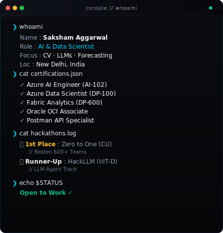
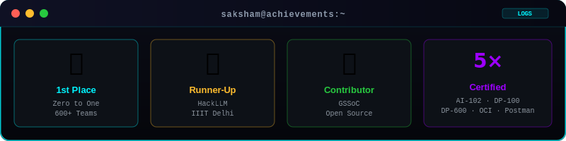

  

  

  

  
  &nbsp;
  
  &nbsp;
  

 

---

### 💻 &nbsp;`$ whoami --verbose`

  

---

### 📊 &nbsp;`$ neofetch --achievements`

  

---

### ⚡ &nbsp;`$ cat tech-stack.md`

  

  

📋 &nbsp;<b>Detailed Skill Breakdown</b> (click to expand)

 

| Category | Technologies |
|---|---|
| **Languages** |     |
| **AI / ML** |      |
| **Cloud** |  |
| **Web / Tools** |    |

---

### 🎓 &nbsp;`$ ls certifications/ -la`

<table>
<tr>
<td align="center" width="155">
   
  <b>Azure AI Engineer</b> <code>AI-102</code>
</td>
<td align="center" width="155">
   
  <b>Data Scientist</b> <code>DP-100</code>
</td>
<td align="center" width="155">
   
  <b>Fabric Analytics</b> <code>DP-600</code>
</td>
<td align="center" width="155">
   
  <b>Oracle OCI</b> <code>Cloud Certified</code>
</td>
<td align="center" width="155">
   
  <b>Postman Expert</b> <code>Student Expert</code>
</td>
</tr>
</table>

---

### 🚀 &nbsp;`$ ls ~/projects --featured`

  
  &nbsp;
  

  
  &nbsp;
  

---

### 📈 &nbsp;`$ git stats --analytics`

  
  &nbsp;&nbsp;
  

  

  

---

### 🏅 &nbsp;`$ ./display-achievements --trophies`

  

---

### 🐍 &nbsp;`$ ./contribution-snake`

  <picture>
    <source media="(prefers-color-scheme: dark)"  srcset="https://raw.githubusercontent.com/SakshamSuper/SakshamSuper/output/github-contribution-grid-snake-dark.svg"/>
    <source media="(prefers-color-scheme: light)" srcset="https://raw.githubusercontent.com/SakshamSuper/SakshamSuper/output/github-contribution-grid-snake.svg"/>
    
  </picture>

---

### 💡 &nbsp;Dev Quote

  

---

### 🌐 &nbsp;`$ open --socials`

  
  &nbsp;
  
  &nbsp;
  
  &nbsp;
  

 

  

